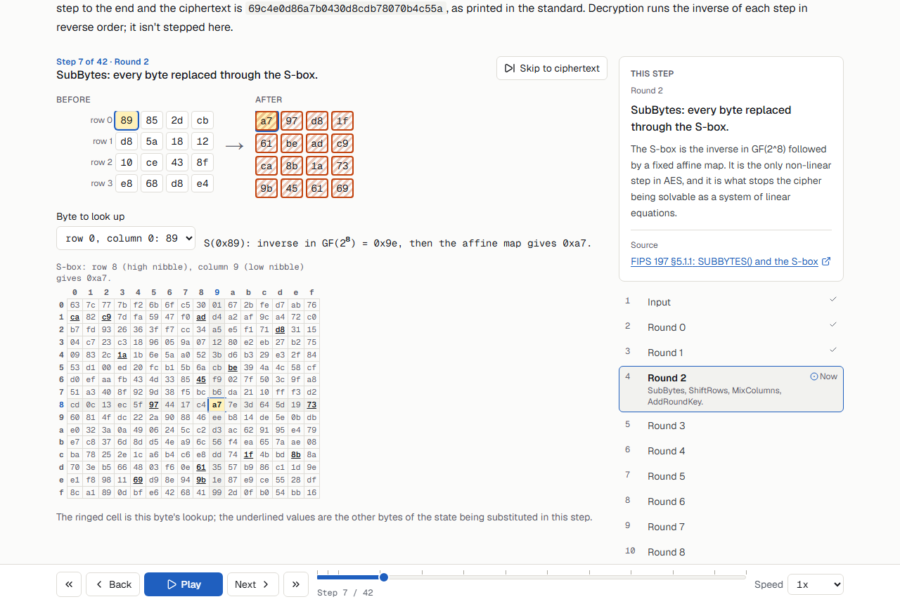
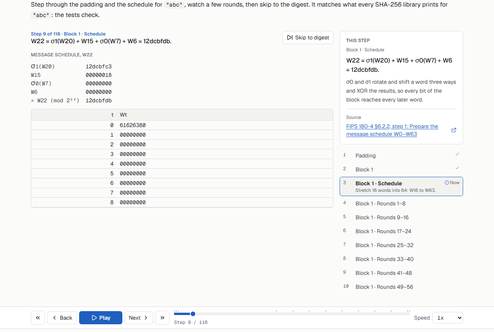
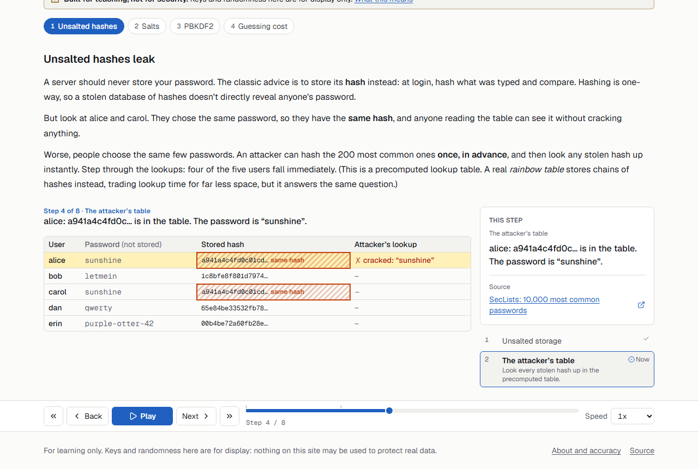
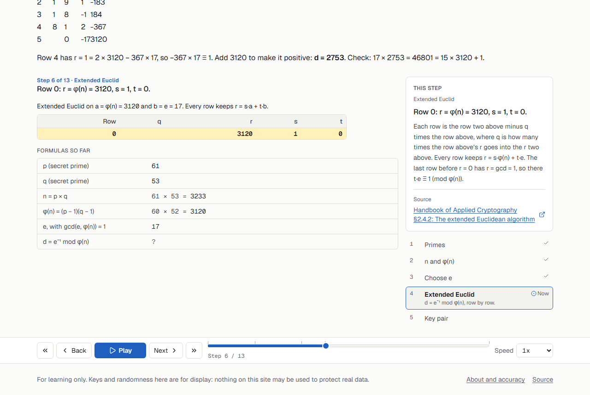
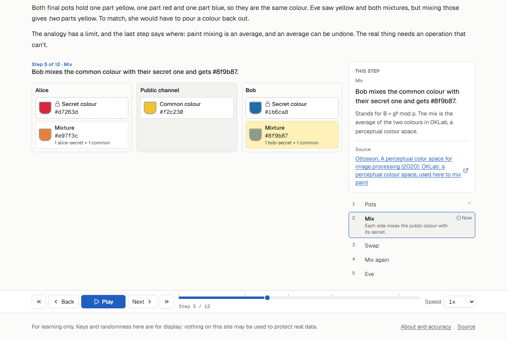

# Crypto Visualizer

The actual maths behind the padlock icon, one step at a time.

Each module runs a real algorithm (XOR, SHA-256, HMAC, PBKDF2, AES, RSA, Diffie-Hellman)
one visible step at a time, forwards and backwards, on a shared timeline. Every step
implementation is written by hand in plain TypeScript and checked against Node's `crypto`
module and the published test vectors. What you watch is the computation itself, not an
animation of it.

**Status:** release candidate. A preview is deployed, and the production URL will be added
here once it's promoted.



## Modules

Each module builds on the one before it.

| #   | Module                                       | What you step through                                                                                                        |
| --- | -------------------------------------------- | ---------------------------------------------------------------------------------------------------------------------------- |
| 1   | [Bits, bytes and XOR](src/modules/xor)       | Text to UTF-8 bytes, hex and binary. XOR as a reversible mask, the one-time pad, and what reusing its key gives away.         |
| 2   | [Hashing and MACs](src/modules/hashing)      | SHA-256 through padding, the message schedule and 64 rounds. The avalanche effect, length extension, and how HMAC fixes it.  |
| 3   | [Passwords and salts](src/modules/passwords) | Why an unsalted hash falls to a precomputed table, what a salt changes, and PBKDF2's iterations stepped for real.            |
| 4   | [AES](src/modules/aes)                       | One 16-byte block through AES-128, round by round on a 4×4 grid. Then ECB and its penguin, CBC with padding, and CTR.        |
| 5   | [RSA](src/modules/rsa)                       | Primes small enough to check on paper: n, φ(n), d by extended Euclid, then encrypt, decrypt, sign, verify, and malleability. |
| 6   | [Diffie-Hellman](src/modules/dh)             | The paint-mixing analogy, then real modular exponentiation. What an eavesdropper sees, and a man-in-the-middle.              |
| 7   | Putting it together: TLS 1.3                 | Planned for phase 2: the RFC 8448 handshake with real values.                                                                |

Any state can be shared. The URL carries the run's inputs and current step as
`?s=<base64url JSON>`, which is validated with Zod when the link is opened. The same input
always replays the same run.

| Hashing: one word of the SHA-256 message schedule | Passwords: two users, one unsalted hash |
| ------------------------------------------------- | --------------------------------------- |
|                  |      |
| **RSA: d by extended Euclid, row by row**         | **Diffie-Hellman: the paint analogy**   |
|                      |             |

## How correctness is checked

An animation looks convincing whether or not it's right, so the site has to be checkable.

- **No crypto library in the core.** `src/core` implements every algorithm itself, byte
  encodings included. A lint rule forbids importing `node:crypto`, Web Crypto or any crypto
  package there, and `tests/boundaries.test.ts` proves the rule fires. If the core called
  the real thing, comparing it with the real thing would prove nothing.
- **Differential tests** in `tests/differential/` compare the core with independent
  sources:

  | Algorithm      | Published vectors                                                     | Against Node                                                                         |
  | -------------- | --------------------------------------------------------------------- | ------------------------------------------------------------------------------------ |
  | SHA-256        | FIPS 180-4 examples, including one million "a"                        | `createHash` on 1,000 seeded inputs, plus every padding edge (lengths 0–130)         |
  | HMAC-SHA-256   | RFC 4231                                                              | `createHmac` on 500 seeded keys, including 63-, 64- and 65-byte keys                 |
  | PBKDF2         | RFC 7914 §11                                                          | `pbkdf2Sync` on 200 seeded cases                                                     |
  | AES-128        | FIPS 197 Appendices A, B and C.1; SP 800-38A Appendix F (ECB, CBC, CTR) | `createCipheriv` and `createDecipheriv` on 1,000 seeded cases                      |
  | RSA            | none                                                                  | OpenSSL raw RSA (`RSA_NO_PADDING`) over several key sizes                            |
  | Diffie-Hellman | RFC 3526 group 14                                                     | `createDiffieHellman`; toy groups, which OpenSSL refuses, against repeated multiplication |

  The AES test checks every intermediate state against the FIPS 197 appendix, not just the
  ciphertext. XOR and UTF-8 have no library to compare against, so they're checked against
  `TextEncoder` and XOR's own algebra in `src/core`.
- **Stepped equals fast.** The version you step through and the fast version share their
  code, and the tests check that they reach the same answer.
- **Citations.** Every step names the section of the standard it comes from.
  `tests/citations.test.ts` fails if a citation doesn't resolve, and
  `tests/accuracy-doc.test.ts` fails if [docs/ACCURACY.md](docs/ACCURACY.md) doesn't list
  it.
- **Determinism.** `tests/determinism.test.ts` runs every built-in scenario twice and
  requires identical output, so a share link always replays the same run.
- **Coverage.** `src/core` must keep 95% statement, branch, function and line coverage.

[docs/ACCURACY.md](docs/ACCURACY.md) has the full list of sources by module, with the
tests behind each one.

## Built for teaching, not for security

- The step implementations are deliberately slow, are not constant-time, and must never
  protect real data. The test suite checks their output against Node's crypto library and
  the published test vectors.
- Keys, salts and nonces come from a seeded, non-cryptographic random generator so every
  state can be replayed and shared. That is exactly what real cryptography must never do.
- RSA and Diffie-Hellman use toy-sized numbers by default so every step can be checked by
  hand. Real key sizes appear only as digit counts.
- bcrypt, Argon2, OAEP, PSS and AES-GCM are explained, not computed. Elliptic curves
  (X25519) are described, not stepped, in v1.
- Password-cracking speeds are illustrative orders of magnitude from the cited source, not
  measurements.

**Privacy.** Everything runs in your browser, and the Content-Security-Policy blocks
connections to any other origin. A password you type is never put in a share link or in
local storage. The deployed site counts page views with Vercel Web Analytics. The query
string is removed before a view is sent, so the inputs in a share link are never reported.

## Local development

```bash
npm install
npm run dev          # http://localhost:3000
npm run verify       # lint, typecheck, unit tests with coverage, build, JS budget
npm run test:e2e     # Playwright + axe against a production build on port 3100
npm run format
```

Before the first `npm run test:e2e`, install the Playwright browser with
`npx playwright install chromium`.

## How it's built

Built with Next.js 16 (App Router), TypeScript, Tailwind CSS v4, Zustand and Zod, and
tested with Vitest and Playwright. There's no database and no server-side computation.
Every route is prerendered.

```
src/core/            pure TypeScript step logic: no React, no crypto library, no clock
src/components/      shared UI: timeline, byte grid, bit-diff strip, modular clock
src/modules/<name>/  one folder per module; renders the core's events, never computes crypto
src/app/             routes
tests/differential/  core vs node:crypto and the published vectors
e2e/                 Playwright + axe on every route, light and dark
```

Dependencies point inward (app → modules → components → core), and ESLint boundary rules
enforce that. The core turns an input into an ordered list of typed events, and the UI
only renders them. Randomness comes from a seeded mulberry32 generator and time from a
virtual timeline. Both are vendored from
[Internet Visualizer](https://github.com/zhongxuen/internet-visualizer) (see
[VENDORED.md](VENDORED.md)). `perf/bundles.mjs` checks that each module route stays within
a budget of 170 KB of gzipped first-load JS.

The phase-by-phase plan is in [docs/implementation/](docs/implementation/00-overview.md).

## License

MIT
